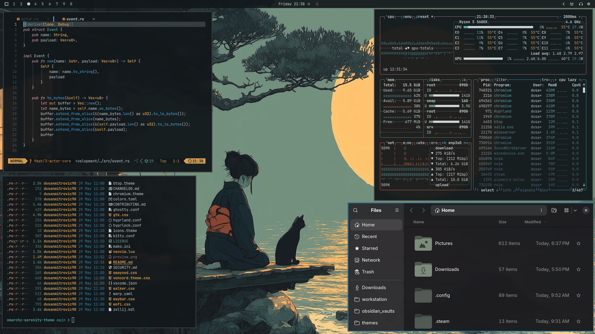

<div align="center">

# Tranquility

[](https://omarchy.org/)
[](https://paypal.me/dusanmitrovic98)
[](https://ko-fi.com/dusanmitrovic)
[](https://github.com/omarchy-themes/omarchy-tranquility-theme/releases)
[](https://github.com/omarchy-themes/omarchy-tranquility-theme/stargazers)
[](https://github.com/omarchy-themes/omarchy-tranquility-theme/network)
[](https://github.com/omarchy-themes/omarchy-tranquility-theme)



*Tranquility theme for Omarchy Arch Linux distribution.*

</div>

### Backgrounds

---


---


---


---


---


---

### Quick Start

To use the theme, you need [Omarchy](https://omarchy.org/).

```bash
omarchy-theme-install https://github.com/omarchy-themes/omarchy-tranquility-theme
```

